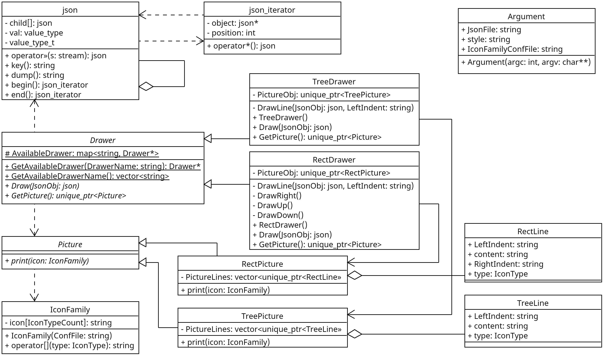
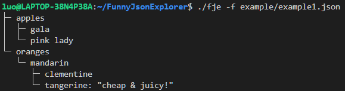
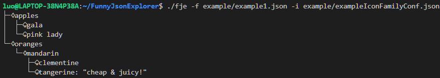
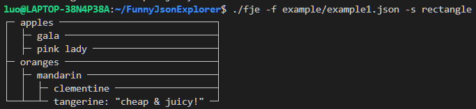
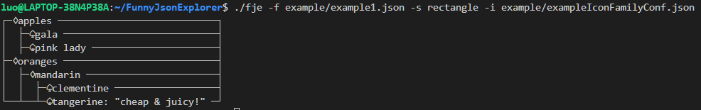

## Funny JSON Explorer
21307270 罗以彬

### 设计文档

#### 参数处理
由`Argument`类的构造函数完成，调用CLI11处理命令行参数

#### json表示
使用`nlohmann/json`读取json文件，用`json`类递归表示。`json`类采用组合模式，对于array和object，`json`类提供了迭代器`json_iterator`遍历所有子项，子项同样使用`json`类表示。

#### 内容生成
使用工厂模式和抽象工厂的设计，不同风格统一使用`Drawer`基类提供的接口，使用时实例化不同风格的工厂

工厂实例使用建造者模式实现，现在类内调用`Draw`及其各项步骤生成输出，再通过`GetPicture`返回输出的产品

#### 图标风格
读取风格设置的json文件，在`IconFamily`保存选用的图标，作为打印可视化内容的函数参数

### 运行截图

### 源代码库
https://github.com/ITcarrot/FunnyJsonExplorer
