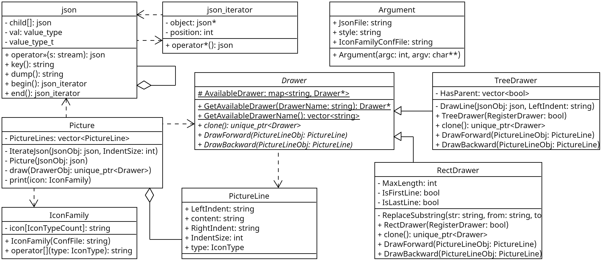

## Funny JSON Explorer
21307270 罗以彬

### 设计文档

#### 参数处理
由`Argument`类的构造函数完成，调用CLI11处理命令行参数

#### json表示
使用`nlohmann/json`读取json文件，用`json`类递归表示。`json`类采用组合模式，对于array和object，`json`类提供了迭代器`json_iterator`遍历所有子项，子项同样使用`json`类表示。

#### 风格选择
由虚基类`Drawer`的静态变量与函数处理工厂注册，通过定义全局变量的方式在派生类处完成注册，实际选取风格时通过`clone`方法返回对应的`Drawer`

#### 内容生成
在构造`Picture`时，将`json`类表示转化为行内容+行偏移量的表示

使用迭代器 + 访问者模式，用迭代器遍历每一行，调用访问者`Drawer`去根据风格需要修饰每一行的输出内容品

#### 图标风格
读取图标设置的json文件，在`IconFamily`保存选用的图标，作为打印可视化内容的函数参数

### 运行截图

### 源代码库
https://github.com/ITcarrot/FunnyJsonExplorer/tree/VisitorDesign
